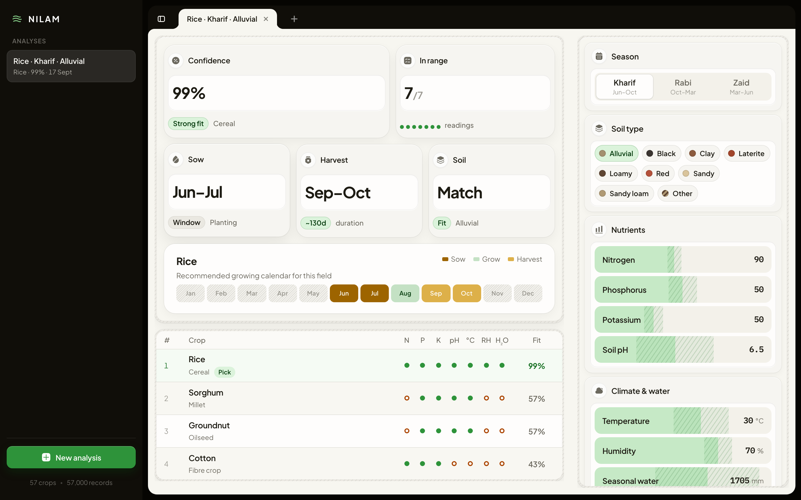

# NILAM

**Crop recommendation for Tamil Nadu fields** — enter soil and climate readings, get ranked crop fits with confidence, calendars, and growing profiles.

<p align="center">
  
</p>

<p align="center">
  <a href="https://github.com/ravixalgorithm/nilam"></a>
  
  
  
  
</p>

---

## Overview

NILAM is a full-stack advisor for matching a field’s conditions to crops. A Random Forest model trained on **57 crops / 57,000 rows** of Tamil Nadu agricultural data ranks candidates from NPK, pH, temperature, humidity, seasonal water, soil type, season, and water source.

The UI is built like a floated desktop app: dark sidebar, Chrome-style tabs, hatch-framed metric shells, live rankings, and a raw dataset viewer.

**Docs:** [Project documentation](docs/PROJECT.md) · [UI design system](frontend/DESIGN.md)

| Layer | Stack |
|-------|--------|
| Frontend | React 18, Vite, Iconsax, Plus Jakarta Sans |
| Backend | FastAPI, scikit-learn, pandas, joblib |
| Model | RandomForest (200 trees), one-hot soil / season / water source |
| Data | Tamil Nadu crop recommendation set ([Mendeley](https://data.mendeley.com/datasets/vynxnppr7j/1), CC BY 4.0) |

> **Note:** The training set is synthetic (CTGAN from regional references). Reported accuracy is for demo / coursework — not field validation.

---

## Features

- **Live recommendations** — results update as soon as every reading is set  
- **Confidence & fit** — top pick with %, reading marks, soil match, sow/harvest window  
- **Crop ranking** — model pick first, then same-season crops scored by how many readings sit in typical range  
- **Growing calendar** — sow / grow / harvest months per crop  
- **Field panel** — season, soil chips, craft sliders for nutrients & climate  
- **Saved analyses** — sidebar history (browser `localStorage`)  
- **Raw data viewer** — open **57 crops · 57,000 records** for a paginated look at training rows  
- **Design system** — see [`frontend/DESIGN.md`](frontend/DESIGN.md)

---

## Quick start

### Prerequisites

- Python **3.10+**
- Node.js **18+** and npm
- Git

### Clone

```bash
git clone https://github.com/ravixalgorithm/nilam.git
cd nilam
```

### Backend

```bash
cd backend
python -m venv .venv
source .venv/bin/activate          # Windows: .venv\Scripts\activate
pip install -r requirements.txt
uvicorn app.main:app --reload --host 127.0.0.1 --port 8000
```

On first run the API trains (or loads) the model and writes `backend/models/`.

| URL | Purpose |
|-----|---------|
| http://127.0.0.1:8000/docs | Swagger |
| http://127.0.0.1:8000/health | Health |
| http://127.0.0.1:8000/metadata | Fields, options, crop profiles |
| http://127.0.0.1:8000/model-info | Metrics & feature list |
| http://127.0.0.1:8000/dataset | Paginated raw rows |

### Frontend

```bash
cd frontend
npm install
npm run dev
```

Open **http://127.0.0.1:5173**

Optional `frontend/.env`:

```env
VITE_API_BASE_URL=http://127.0.0.1:8000
```

### Windows one-click

From the repo root: `start_all.bat` (or `start_backend.bat` / `start_frontend.bat`).

---

## How to use

1. Click **New analysis** (or use a sample tile such as Rice on the empty state).  
2. Set **season**, **soil**, **water source**, and drag/type each nutrient & climate reading.  
3. Watch the left workspace: confidence bento, calendar, and ranked crop list.  
4. Open a crop for profile detail; save from the tab flow to keep it in the sidebar.  
5. Click the footer **57 crops · 57,000 records** to browse training data.

---

## API

### Predict

`POST /predict`

```json
{
  "N": 90,
  "P": 50,
  "K": 50,
  "ph": 6.5,
  "temperature": 30,
  "humidity": 70,
  "water": 1705,
  "soil": "Alluvial",
  "season": "kharif",
  "water_source": "irrigated"
}
```

```json
{
  "best_crop": "rice",
  "top_recommendations": [
    { "crop": "rice", "confidence": 0.99 },
    { "crop": "sorghum", "confidence": 0.01 }
  ]
}
```

Soil values: `Alluvial`, `Black`, `Clay`, `Laterite`, `Loamy`, `Red`, `Sandy`, `Sandy loam`, `Other`  
Season: `kharif`, `rabi`, `zaid` · Water: `irrigated`, `rainfed`

---

## Model & data

| Item | Detail |
|------|--------|
| Dataset | 57 crops × 1,000 rows (Tamil Nadu crop recommendation) |
| Features | N, P, K, soil pH, temp, RH, seasonal water, soil, season, water source |
| Held-out | ~99.3% accuracy · 100% top-3 (see `GET /model-info`) |
| Preprocessing | 34 soil labels → 9 groups; crop identity columns not used as inputs |

Source: [doi:10.17632/vynxnppr7j.1](https://data.mendeley.com/datasets/vynxnppr7j/1) (CC BY 4.0).  
Reference CSV `backend/data/Crop_recommendation.csv` (22-crop classic set) is kept for the notebook only.

Exploration notebook: [`notebooks/Crop_Recommendation_Testing_Final.ipynb`](notebooks/Crop_Recommendation_Testing_Final.ipynb)

---

## Repository layout

```text
nilam/
├── backend/
│   ├── app/                 # FastAPI + model service
│   ├── data/                # Tamil Nadu CSV (+ legacy CSV)
│   ├── models/              # joblib artifact (generated)
│   └── requirements.txt
├── frontend/
│   ├── src/                 # React app (App, Slider, styles)
│   ├── DESIGN.md            # UI craft / design system
│   └── package.json
├── docs/
│   ├── dashboard.png        # README screenshot
│   └── PROJECT.md           # Detailed architecture & API docs
├── notebooks/
├── start_*.bat
└── README.md
```

---

## Design

Interface language (tokens, chrome, hatch shells, bento, motion) is documented in **[frontend/DESIGN.md](frontend/DESIGN.md)** so new screens stay consistent with NILAM.

---

## License & attribution

Application code in this repository is provided for education and demonstration.

Training data © contributors of the Tamil Nadu crop recommendation dataset on Mendeley, licensed [CC BY 4.0](https://creativecommons.org/licenses/by/4.0/).

---

<p align="center">
  <strong>NILAM</strong> · land · field · fit
</p>
